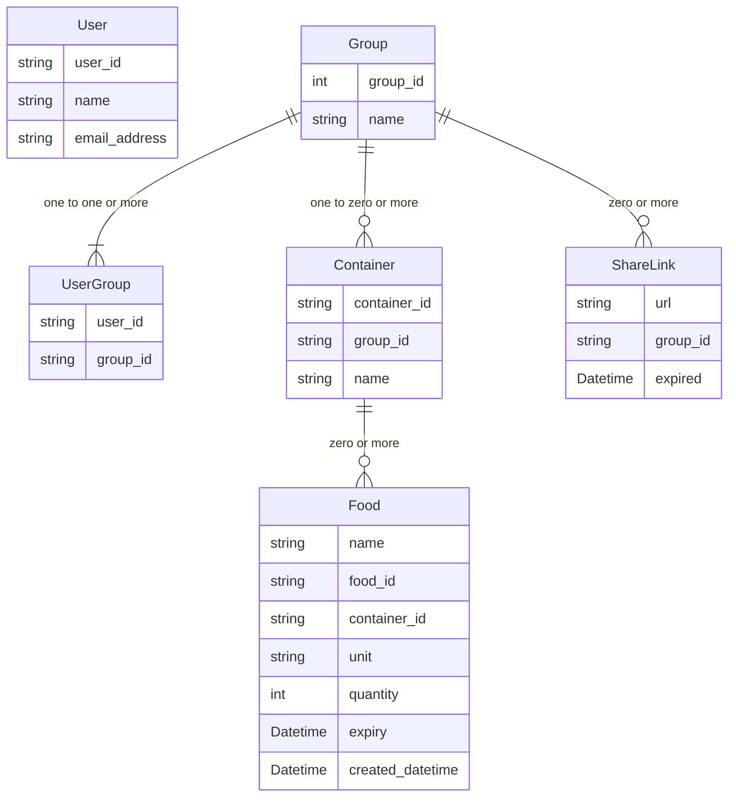

# ER Diagram

```mermaid
erDiagram

User {
    string user_id
    string name
    string email_address
}

UserGroup {
    string user_id
    string group_id
}

Group {
    int group_id
    string name
}

Container {
    string container_id
    string group_id
    string name
}

Food {
    string name
    string food_id
    string container_id
    string unit
    int quantity
    Datetime expiry
    Datetime created_datetime
}

ShareLink {
    string url
    string group_id
    Datetime expired
}

Group ||--|{ UserGroup : "one to one or more"
Group ||--o{ Container : "one to zero or more"
Container ||--o{ Food : "zero or more"
Group ||--o{ ShareLink : "zero or more"


```
