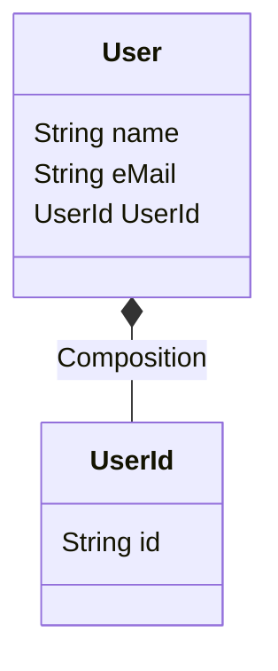
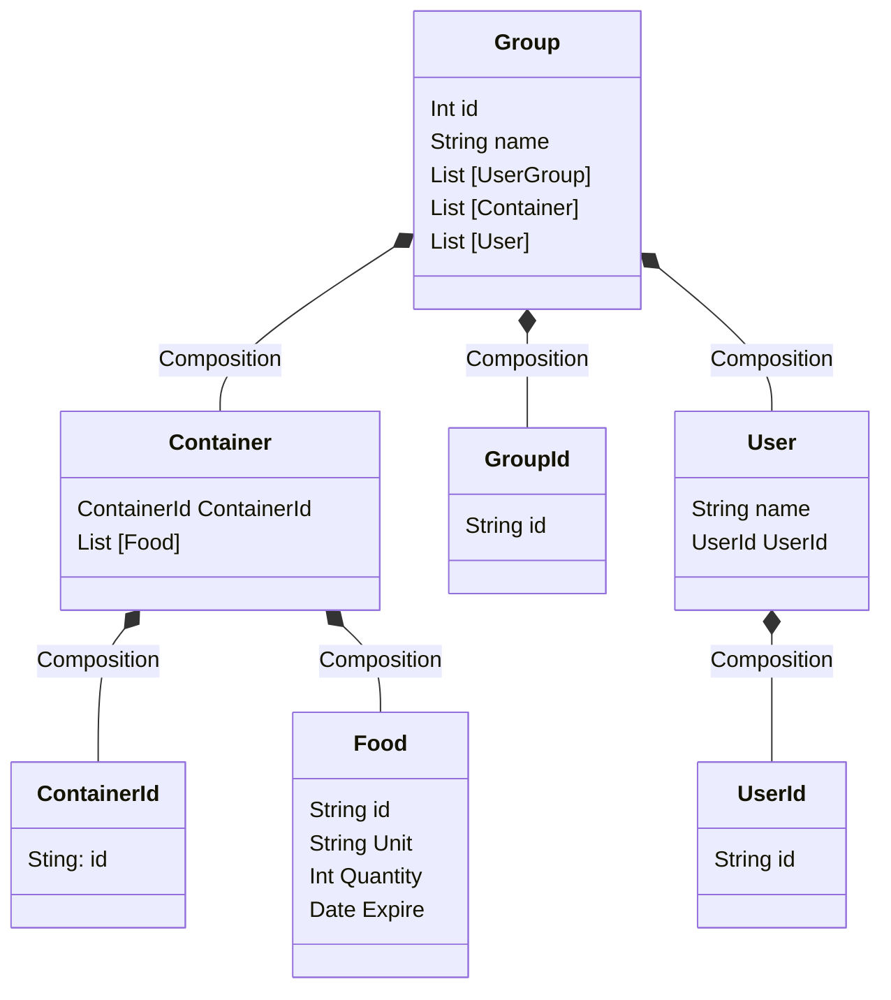

# Domain Model

## User Context

```mermaid
classDiagram

    class UserId {
        String id
    }

    class User {
        String name
        String eMail
        UserId UserId
    }

    User *-- UserId : Composition


```

## Group Context

```mermaid
classDiagram

    class UserId {
        String id
    }

    class User {
        String name
        UserId UserId
    }


    class GroupId {
        String id
    }

    class Group {
        Int id
        String name
        List [UserGroup]
        List [Container]
        List [User]
    }

    class Container {
        ContainerId ContainerId
        List [Food]
    }

    class ContainerId {
        Sting: id
    }

    class Food {
        String id
        String Unit
        Int Quantity
        Date Expire

    }

    User *-- UserId : Composition

    Group *-- GroupId : Composition
    Group *-- Container : Composition
    Group *-- User : Composition

    Container *-- ContainerId : Composition
    Container *-- Food : Composition

```

## User ID

Identifier

The ID is created by Cognito User Pool.

## User

Entity
