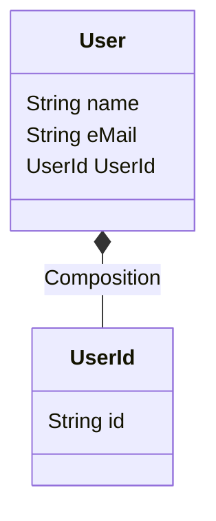
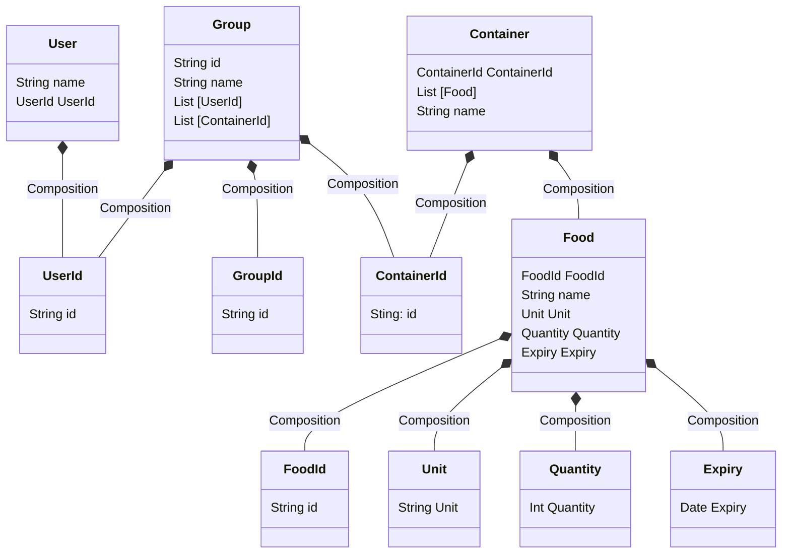

# Domain Model

## User Context

```mermaid
classDiagram

    class UserId {
        String id
    }

    class User {
        String name
        String eMail
        UserId UserId
    }

    User *-- UserId : Composition


```

## Group Context

```mermaid
classDiagram

    class UserId {
        String id
    }

    class User {
        String name
        UserId UserId
    }


    class GroupId {
        String id
    }

    class Group {
        String id
        String name
        List [UserId]
        List [ContainerId]
    }

    class Container {
        ContainerId ContainerId
        List [Food]
        String name
    }

    class ContainerId {
        Sting: id
    }

    class Food {
        FoodId FoodId
        String name
        Unit Unit
        Quantity Quantity
        Expiry Expiry
    }

    class FoodId {
        String id
    }

    class Unit {
        String Unit
    }

    class Quantity {
        Int Quantity
    }

    class Expiry {
        Date Expiry
    }

    User *-- UserId : Composition

    Group *-- GroupId : Composition
    Group *-- ContainerId : Composition
    Group *-- UserId : Composition

    Container *-- ContainerId : Composition
    Container *-- Food : Composition

    Food *-- FoodId : Composition
    Food *-- Unit : Composition
    Food *-- Quantity : Composition
    Food *-- Expiry : Composition

```
